# Oracle Resource Manager on OCI Hands-On (Oracle Modern Cloud Day 2019의 Tech Hands-on Track)


<-- MCD 관련 이미지로 교체 >
 
## Introduction
본 핸즈온 문서는 Oracle Resource Manager와 Terraform Configuration을 사용하여 간단한 샘플 웹 애플리케이션 운영을 위한 배포 환경을 Oracle Cloud Infrastructure 환경에 자동으로 구성하고 배포하는 과정을 다루고 있습니다. 본 과정을 통해서 기본적인 오라클 클라우드 인프라 구성을 위한 서비스 리소스와 Terraform 코드를 통해 Oracle Cloud 인프라 구성 및 애플리케이션 배포를 자동화 해보는 경험을 해볼 수 있습니다.

## Objectives
* Oracle Cloud Infrastructure 리소스 이해
* Oracle Resource Manager 및 Terraform Configuration 이해
* Oracle REsource Manager Stack 생성 코드 작성
* Oracle Resource Manager Job 실행

## Required Artifacts
* 인터넷 접속 가능한 랩탑
* OCI (Oracle Cloud Infrastructure) 계정
* SSH Terminal (windows Putty, macOS Terminal 등)

## Client 접속 환경
```
ssh -i id_rsa opc@140.238.18.26
```
실습 환경 접속 정보 받기

## Terraform과 Oracle Resource Manager (장표 설명: 10분 ~ 15분)
Presentation은 Gitpitch를 사용할 예정임.
[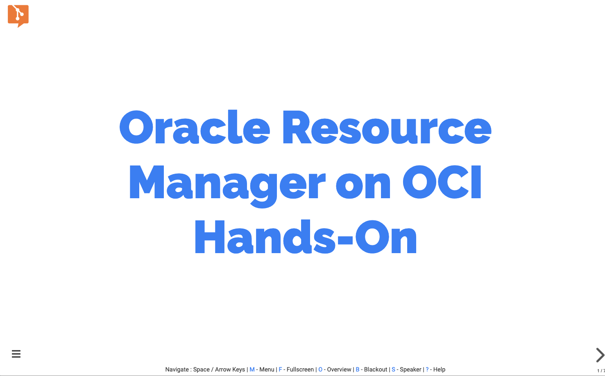](https://gitpitch.com/mangdan/oracle-resource-manager-handson#/)

### Terraform
Terraform은 Hashicorp에서 개발한 인프라스트럭처 관리를 위한 오픈소스 소프트웨어로, 인프라스트럭처를 코드로서 관리 및 프로비저닝하는 개념인 Ifrastructure as Code (IaC)를 지향하는 도구라고 볼 수 있습니다. Terraform에서는 HCL(Hachicorp Configuration Language)라는 설정 언어를 이용해서 인프라스트럭처를 정의합니다.

### Resource Manager
Oracle Resource Manager는 Oracle Cloud Infrastructure(이하 OCI)의 리소스 프로비저닝을 자동화 하는 기능으로, Terraform Configuration 사용해서 실행하는 기능입니다. Resource Manager를 사용하면 별도 클라이언트 환경에 Terraform 설치나 환경 구성이 필요 없으며, OCI Console을 통해 Terraform Configuration을 관리, Apply, Plan, Destroy를 할 수 있습니다. 이외에도 Terraform Configuration 실행 로그 관리, IAM(Identity and Access Management)를 통한 사용자 통제, Terraform 변수 및 상태 (State: Terraform Configuration을 Apply할 때 Apply한 결과를 가지는 파일로 인프라 변경내용을 추적할 수 있음) 관리
등의 기능을 제공합니다.

Stack
스택은 Terraform Configuration 묶음을 등록하여 생성하는 Provisioning 단위입니다.

Job
Job은 스택으로 등록된 Terraform Configuration의 실행 작업이며, Terraform에서 경험한 것 처럼 Terraform Plan, Apply, Destroy이 실행되는 작업입니다.

## 실습을 위한 클라이언트 환경
다음 주소를 클릭합니다. 본인의 이메일 주소를 입력하면 실습을 위한 클라이언트 환경을 할당받을 수 있습니다.
--- 여기서 이메일 입력, 제출 클릭하면 Private/Public Key (Putty, OpenSSH), IP, 접속 계정을 전달 받는다.

## 샘플 애플리케이션
샘플 애플리케이션은 MuShop 이라는 이름을 가진 이커머스 웹 사이트(고양이 관련 용품 판매)로 3-tier로 구성된 웹 애플리케이션입니다.
해당 애플리케이션에는 애플리케이션 구동에 필요한 모든 리소스와 설정을 담고 있는 Terraform 코드를 포함하고 있습니다.


|  |  |  |  |
|---|---|---|---|

## Topology


## Components
.....

## Hands-On Steps (30분)
**STEP 1**: Resource Manager 환경 구성  
**STEP 2**: OCI Resource Manager를 위한 Stack Zip Package 생성  
**STEP 3**: Resource Manager Stack 생성  
**STEP 4**: Resource Manager Apply Job 실행  
**STEP 5**: 생성된 OCI Resource와 웹 애프리케이션 배포 확인  
**STEP 6**: 생성된 모든 리소스 삭제  
**STEP 7**: 삭제 리소스 확인  

***

## **STEP 1**: Resource Manager 환경 구성

### Compartment 만들기
<font color='red'>이미 만들어진 Compartment가 있을 경우 이 단계는 건너뜁니다.</font>
> ***Compartment***   
> 모든 OCI 리소스는 특정 Compartment에 속하게 되며 Compartment 단위로 사용자들의 접근 정책을 관리할 수 있습니다. 처음에는 Root Compartment가 만들어지며, Root Compartment 하위에 추가 Compartment를 생성할 수 있습니다. OCI 클라우드 리소스를 쉽게 관리하기 위한 일종의 폴더 개념이라고 생각하면 됩니다. 부서나 프로젝트등을 고려해서 Compartment를 구성하여 해당 Compartment별로 세부적인 권한을 부여할 수 있습니다.

먼저 OCI Console에 로그인합니다.

1. https://console.us-ashburn-1.oraclecloud.com 접속 후 Tenant 입력 > **Continue** 클릭


2. Identity Provider를 oracleidentitycloudservice 선택(Default) > **Continue** 클릭


3. 사용자 이름(User Name)과 암호(Password) 입력 후 **Sign In** 클릭


4. OCI Main 페이지, **I accept all cookies** 클릭하여 쿠키 수락


5.  좌측 상단의 햄버거 모양의 메뉴 아이콘 클릭 > Identity 선택 > Compartments 선택
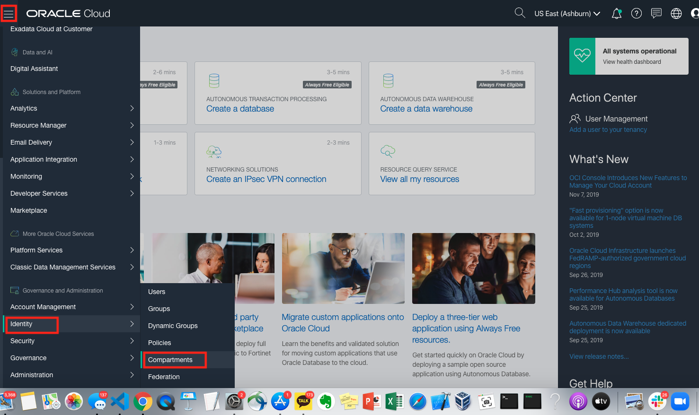

### Git Repository에서 소스 다운로드 받기
Resource Manager를 활용하여 OCI에 리소스 생성 및 배포를 위한 소스를 제공된 Git Repository에서 다운로드 받는 과정입니다.

1. 먼저 작업을 위한 클라이언트에 접속합니다. 터미널 혹은 Putty를 오픈한 후 다음과 같이 접속합니다.
    ```
    $ ssh -i mcd_id_rsa opc@140.238.2.225
    ```

2. 접속 후 할당된 유저로 전환합니다.
    ```
    $ sudo su - user1
    ```

3. Resource Manager에서 사용할 Terraform Configuration과 웹 애플리케이션 소스를 포함하는 소스를 Github Repository에서 다운로드 받습니다.
    ```
    $ git clone https://github.com/MangDan/oracle-resource-manager-handson
    ```

## **STEP 2**: OCI Resource Manager를 위한 Stack Zip Package 생성

### Docker 이미지 만들기
다운로드 받은 소스에는 웹 애플리케이션 소스와 Terraform Configuration, Docker Image를 생성하기 위한 Docker 파일을 포함합니다. 포함된 Dockerfile을 이용해서 Image를 생성합니다.

1. 다음 명령어로 Dockerfile을 이용하여 Image Build.
    ```
    $ cd oracle-resource-manager-handson/oci-quickstart-cloudnative

    $ docker build -t mushop-basic -f deploy/basic/Dockerfile .
    ```

2. OCI Resource Manager Stack Zip 패키지 생성
    ```
    $ docker run -v $PWD:/transfer --rm --entrypoint cp mushop-basic:latest /package/mushop-basic-stack.zip /transfer/mushop-basic-stack.zip
    ```

3. 브라우저에 아래 URL입력 후 생성된 Zip 패키지 다운로드
    {os_user명}에 할당받은 os user를 입력 (e.g. user101)
    ```
    http://132.145.83.122/admin/oracle-resource-manager-handson/oci-quickstart-cloudnative/mushop-basic-stack.zip
    ```

## **STEP 3**: Resource Manager Stack 생성
Terraform Configuration과 웹 애플리케이션 소스를 포함하고 있는 Zip 파일을 OCI Resource Manager Stack으로 등록하는 과정입니다.

1. OCI Console에 로그인한 후 좌측 상단의 햄버거 버튼 클릭 > Resource Manager 클릭 > Stacks 클릭
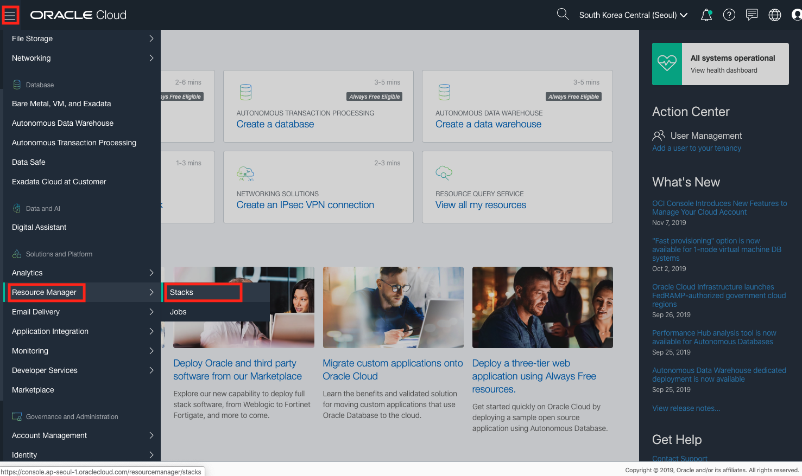

2. 앞에서 생성한 Compartment 선택 후 **Create Stack** 클릭
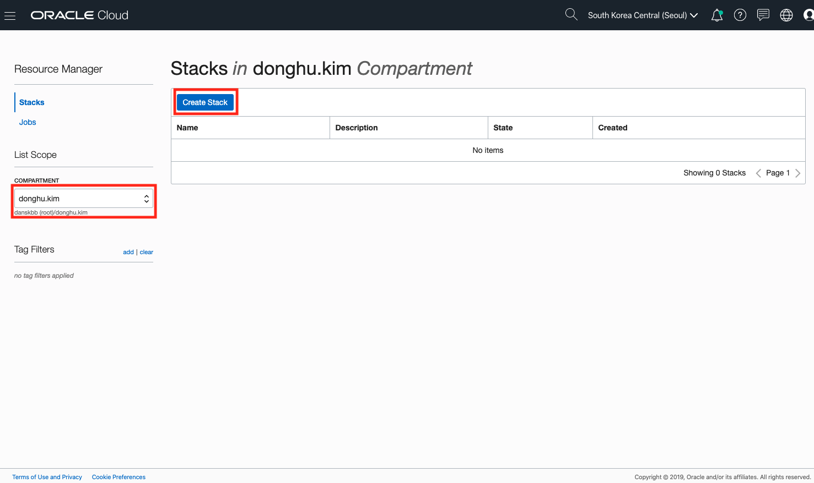

3. 다운로드 받은 Zip 패키지를 선택, Name 입력(자동 생성), Compartment 선택, Terraform Version 선택 (본 실습에서는 0.11.x 버전으로 진행) 후 **Next** 클릭
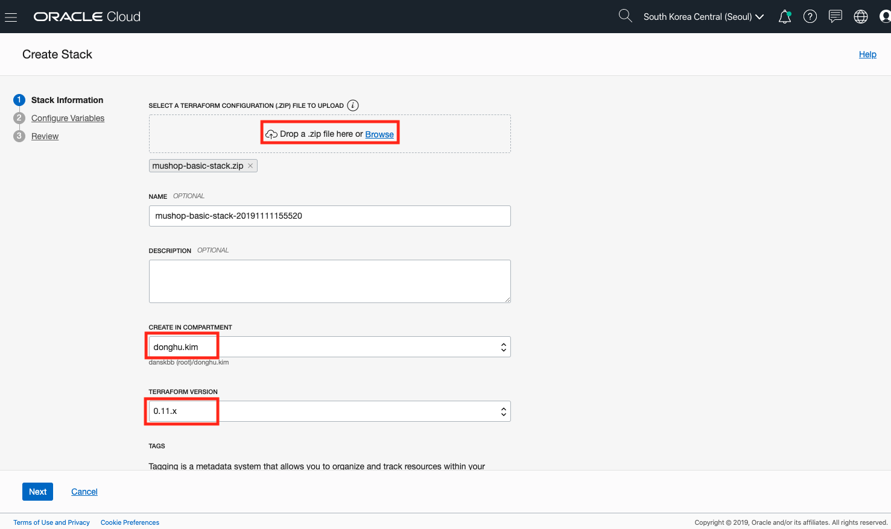

4. Database Name (기본 선택), Node Count (2), Available Domain 선택 후 **Next** 클릭
 

5. Stack Review 후 **Create** 버튼 클릭하여 생성
 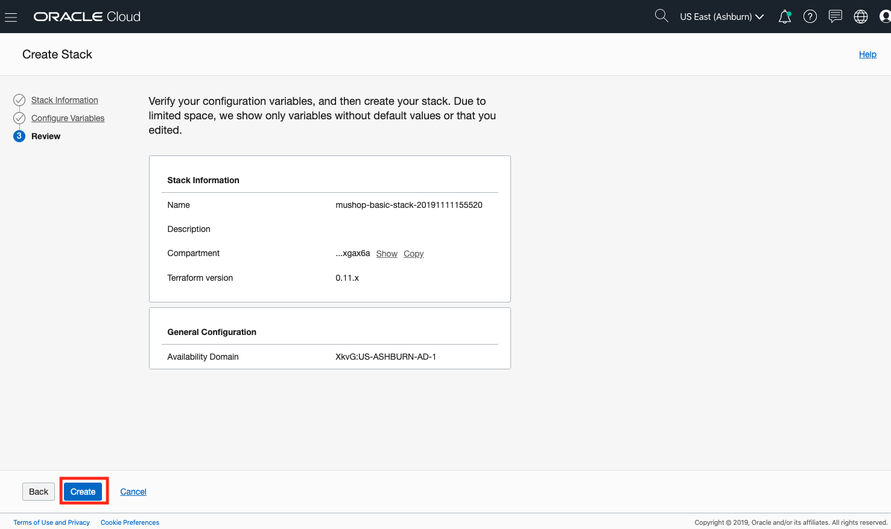

6. Stack 생성 완료
 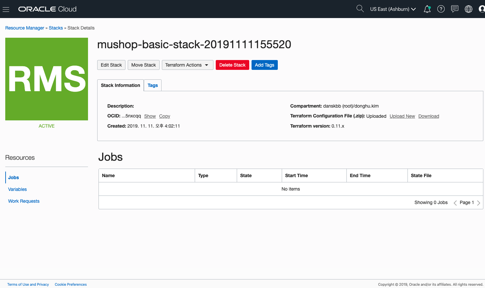

## **STEP 4**: Resource Manager Apply Job 실행
1. Terraform Configuration 적용을 위해서 Terraform Actions > Apply를 클릭합니다.
 

2. 실행할 Job Name (자동 생성) 확인 후 **Apply**를 클릭합니다.
 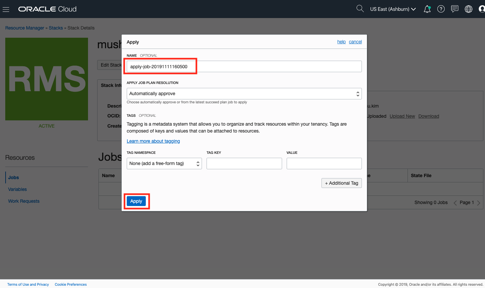

3. Terraform Configuration을 적용하는 Job 실행 과정을 로그로 보여줍니다.
 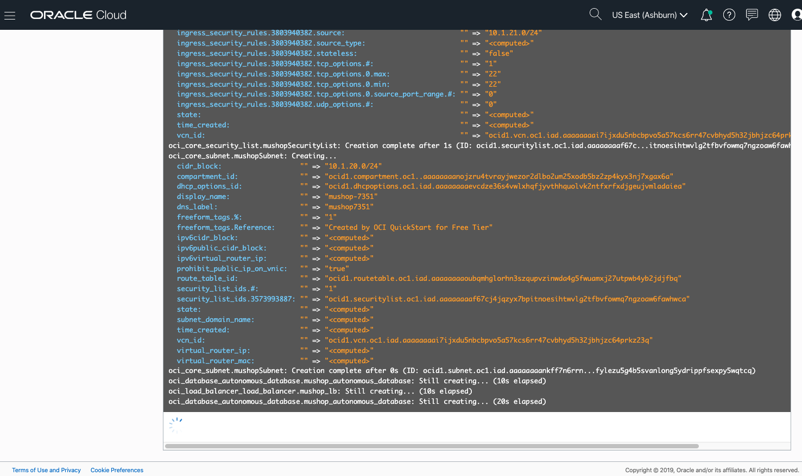

4. Job 실행 완료, 하단에 Load Balancer의 External IP를 확인할 수 있습니다. (http://129.213.211.152/)
 

## **STEP 5**: 생성된 OCI Resource와 웹 애프리케이션 배포 확인
1. Compute Instance 확인 (메뉴 > Compute > Instances)
 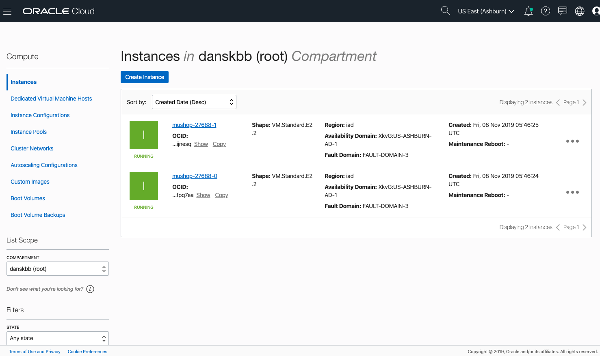

2. VCN 확인 (메뉴 > Networking > Virtual Cloud Networks)
 

3. Load Balancer 확인 (메뉴 > Networking > Load Balancers)
 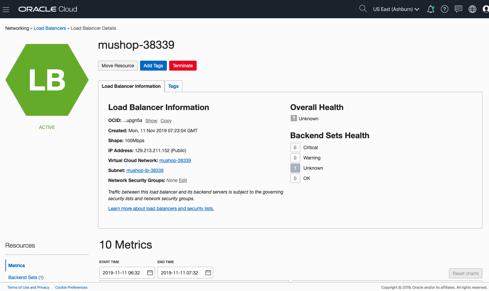


4. ATP 확인 (메뉴 > Autonomous Transaction Processing)
 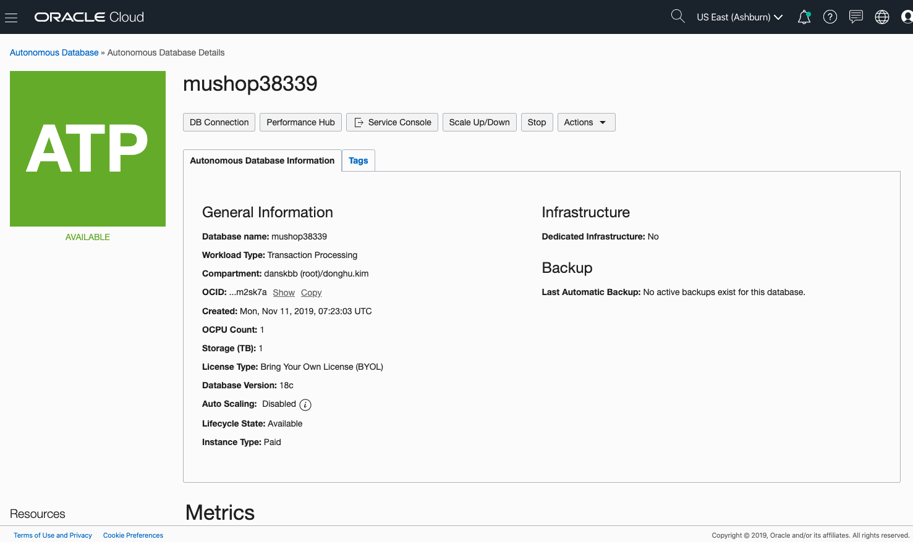


5. Object Storage 확인 (메뉴 > Object Storage)
 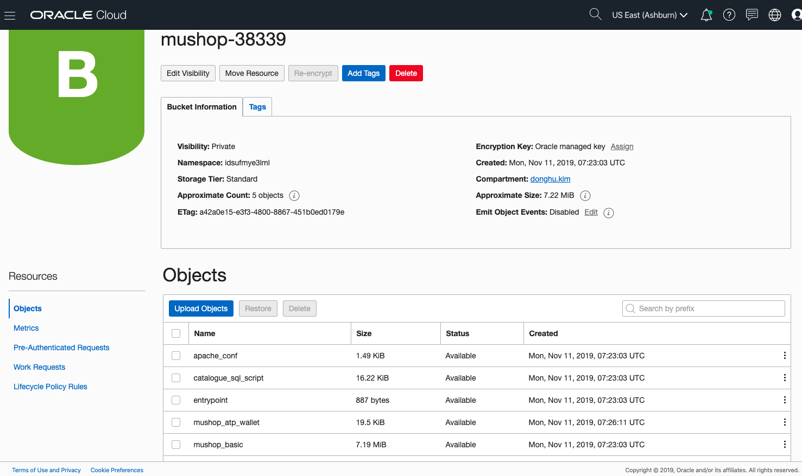


6. Policy 확인 (메뉴 > Identity > Policies, Compartment를 root로 선택)
 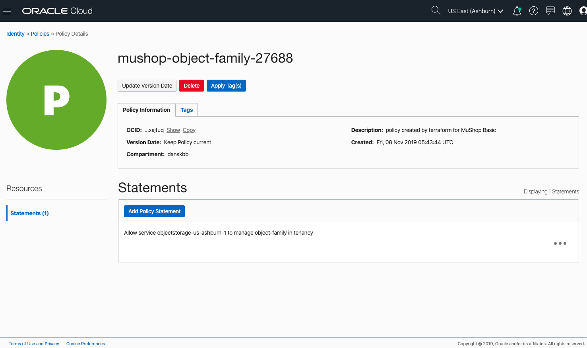


7. 접속 확인 (http://129.213.211.152/)
 

## **STEP 6**: 생성된 모든 리소스 삭제
1. Resource Manager Stack에서 Destroy를 통해 Stack으로 생성된 모든 리소스 삭제
 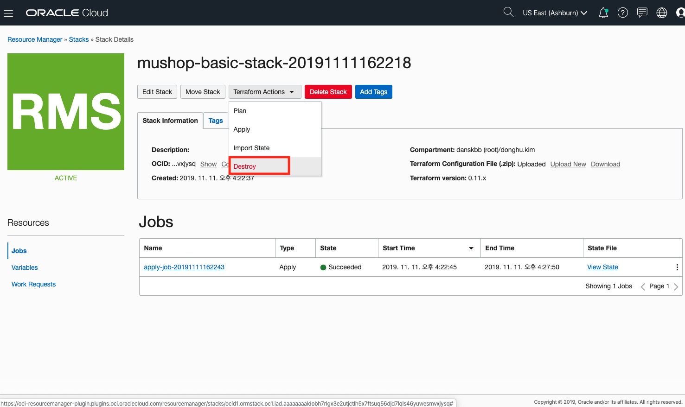

2. Job 이름 입력 (자동 생성)
 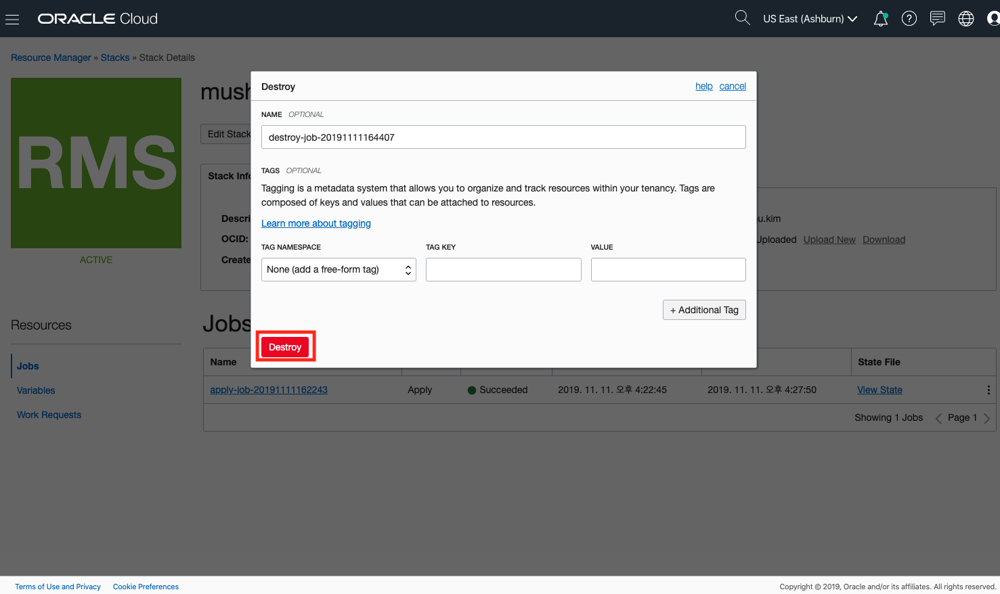

3. Destroy 진행중
 

4. Destroy 완료
 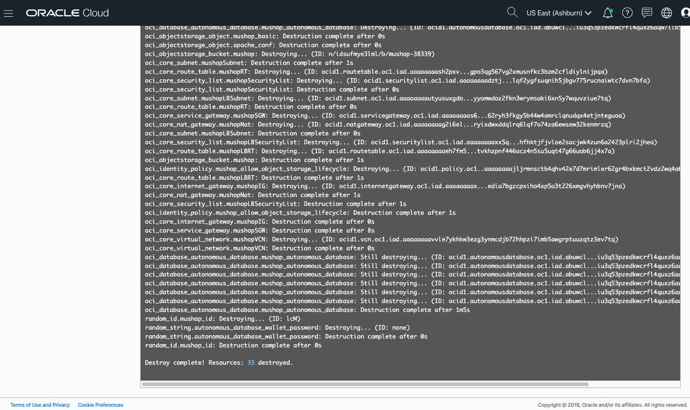

## **STEP 7**: 삭제 리소스 확인
STEP5에서와 동일하게 모든 OCI 리소스 확인