# 나 혼자 시작하는 Oracle Cloud 첫걸음: OCI로 시작하는 Infrastructure as Code

Oracle Modern Cloud Day 2019의 Developer Hands-on Track


 
## Introduction
본 핸즈온 문서는 Oracle Resource Manager와 Terraform Configuration을 사용하여 간단한 샘플 웹 애플리케이션 운영을 위한 배포 환경을 Oracle Cloud Infrastructure 환경에 자동으로 구성하고 배포하는 과정을 다루고 있습니다. 본 과정을 통해서 기본적인 오라클 클라우드 인프라 구성을 위한 서비스 리소스와 Terraform 코드를 통해 Oracle Cloud 인프라 구성 및 애플리케이션 배포를 자동화 해보는 경험을 해볼 수 있습니다.

## Objectives
* Oracle Cloud Infrastructure 리소스 이해
* Oracle Resource Manager 및 Terraform Configuration 이해
* Oracle REsource Manager Stack 생성 코드 작성
* Oracle Resource Manager Job 실행

## Required Artifacts
* 인터넷 접속 가능한 랩탑
* OCI (Oracle Cloud Infrastructure) 계정
* SSH Terminal (windows Putty, macOS Terminal 등)

## 실습을 위한 클라이언트 환경
본 실습을 위해서 각 개인별로 한 개의 Oracle Cloud Trial과 실습을 진행하기 위한 클라이언트 환경을 제공합니다.  
클라이언트 환경 접속에 대한 정보는 별도로 제공합니다.  

## 시나리오


## Hands-On (30분)
### ***[PART 1]*** Hello!! Resource Manager and Terraform
Terraform과 Resource Manager를 활용하여 간단한 예제 (OCI에 Object Storage 만들고 실제로 파일을 업로드)를 실행해 봄으로써, Infrastructure as Code에 대한 기본적인 개념을 이해합니다.

<details>
<summary>
<i>PART1 따라하기</i>
</summary>

총 7개의 단계로 구성됩니다.  
**STEP 1**: 샘플 Resource Manager Zip 패키지 다운로드  
**STEP 2**: Resource Manager Zip 패키지 이해  
**STEP 3**: OCI Console 로그인  
**STEP 4**: Resource Manager Stack 생성  
**STEP 5**: Resource Manager Plan Job 실행하여 실행 계획 확인  
**STEP 6**: Resource Manager Apply Job 실행하여 인프라에 반영  
**STEP 7**: Resource Manager Apply Destroy Job 실행하여 생성된 리소스 삭제 

***

### STEP 1: 샘플 Resource Manager Zip 패키지 다운로드 
Resource Manager에서 사용할 Terraform Configuration을 포함하는 Zip 패키지 파일 [oci-object-storage.zip](https://objectstorage.ap-seoul-1.oraclecloud.com/n/apackrsct01/b/bucket-20190614-1639/o/oci-object-storage.zip)을 다운로드 받습니다.

### STEP 2: Resource Manager Zip 패키지 이해 
내용을 확인하기 위해서 다운로드 받은 Zip 압축 파일을 압축 해제합니다. 구조는 다음과 같습니다. 
> 실제 Resource Manager에서 사용할 경우는 압축된 Zip파일을 사용합니다.
```
.
├── oci-object-storage.zip
│   ├── provider.tf
│   ├── main.tf
│   ├── outputs.tf
│   ├── variables.tf
│   ├── datasources.tf
│   ├── schema.yaml
│   └── application.tar.gz
└──
```

[참고1](https://docs.cloud.oracle.com/iaas/Content/API/SDKDocs/terraformconfig.htm)
[참고2](https://docs.cloud.oracle.com/iaas/Content/ResourceManager/Concepts/terraformconfigresourcemanager.htm#schemadoc)

**provider.tf**  
> 클라우드 제공 벤더를 기술합니다. Oracle Cloud는 provider명은 **"oci"** 입니다. Resource Manager를 사용하면 tenancy_ocid만 지정해주면 됩니다. (로컬에서 사용할 경우 나머지 항목 모두 설정)

**main.tf**  
> 가장 기본이 되면서 실행 가장 우선 실행됩니다. 생성하고자 하는 리소스들 중에서 가장 핵심이 되는 내용이 포함됩니다.

**outputs.tf**  
> 마찬가지로 기본 HCL 파일이며, 보통 Terraform Apply 완료 시 보여주고자 하는 메시지가 포함됩니다.

**variables.tf**  
> 다른 HCL 파일에서 참조할 변수 값을 가지고 있습니다. Oracle Resource Manager를 사용하면, 파일내에 지정한 변수를 UI에서 재지정할 수 있으며, 일부 OCI에 특화된 변수의 경우 값을 지정하지 않더라도, OCI 환경에 맞게 자동으로 할당됩니다.

**datasources.tf**  
> variable이 미리 정의해서 사용하는 값을 담고 있다면, datasources는 인프라의 정보를 담고 있습니다. 예를 들면, Oracle Cloud내의 각 리소스에 대한 정보, Region, Tenancy, Compartment에 대한 정보등이 있습니다.

**schema.yaml**  
> Oracle Cloud의 Resource Manager를 통해 HCL 파일들을 Zip으로 압축한 파일을 Stack이라는 이름으로 생성해서 관리합니다. Stack을 생성할 때 변수를 지정할 수 있는데, 이 때 UI에서 간편하게 입력할 수 있도록 (예로 Select Box에서 AD 선택) 이 yaml 파일에 정의할 수 있습니다.

**application.tar.gz**  
> 본 실습에서는 Oracle Cloud에 Object Storage를 생성합니다. 생성된 Object Storage에 업로드할 실습용 샘플 파일입니다.

### **STEP 3**: OCI Console 로그인
> https://console.ap-seoul-1.oraclecloud.com 접속 > Tenant 입력 > **Continue** 클릭 > Oracle Cloud Infrastructure 아래 사용자 이름(User Name)과 암호(Password) 입력 > **Sign In** 클릭

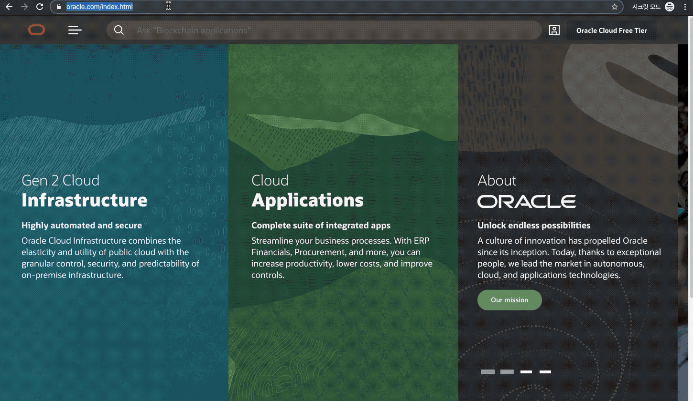

### **STEP 4**: Resource Manager Stack 생성
Terraform Configuration과 웹 애플리케이션 소스를 포함하고 있는 Zip 파일을 OCI Resource Manager Stack으로 등록하는 과정입니다.
> Terraform HCL 파일의 묶음이라고 이해하면 됩니다. 이 Stack을 실행하는 과정은 Job이라는 용어를 사용합니다.

1. Resource Manager의 Stacks
    > 좌측 상단의 햄버거 메뉴 > Resource Manager > Stacks > MCD Compartment 선택

    <details>
    <summary>
    <i>참고) Compartment (구획)</i>
    </summary>

    <font color='red'>본 실습 세션에서는 미리 준비된 MCD Compartment를 사용합니다.</font>
    > ***Compartment***   
    > 모든 OCI 리소스는 특정 Compartment에 속하게 되며 Compartment 단위로 사용자들의 접근 정책을 관리할 수 있습니다. 처음에는 Root Compartment가 만들어지며, Root Compartment 하위에 추가 Compartment를 생성할 수 있습니다. OCI 클라우드 리소스를 쉽게 관리하기 위한 일종의 폴더 개념이라고 생각하면 됩니다. 부서나 프로젝트등을 고려해서 Compartment를 구성하여 해당 Compartment별로 세부적인 권한을 부여할 수 있습니다. Compartment 생성은 **메뉴 > Identity > Compartment > Create Compartment 클릭**하여 생성할 수 있습니다. 

    </details>

    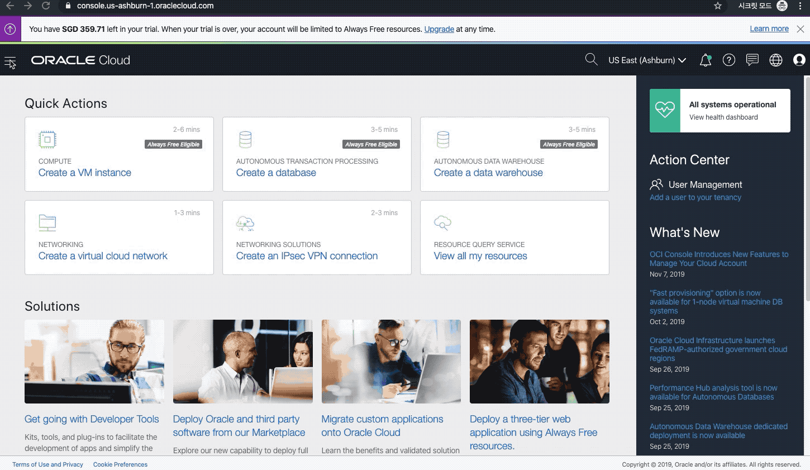

2. Resource Manager Stack 생성 1
    > **Create Stack** 클릭 > 다운로드 받은 Zip 패키지 선택 > Compartment(MCD) 선택 > Terraform Version 선택 (본 실습에서는 0.11.x 버전으로 진행) > **Next** 클릭

    

3. Resource Manager Stack 생성 2
    > Terraform 변수 값 (Variables)을 다음과 같이 변경 
    > 
    > 생성된 Available Domain 선택 > **Next** 클릭 > Stack Review 에서 **Create** 버튼 클릭

    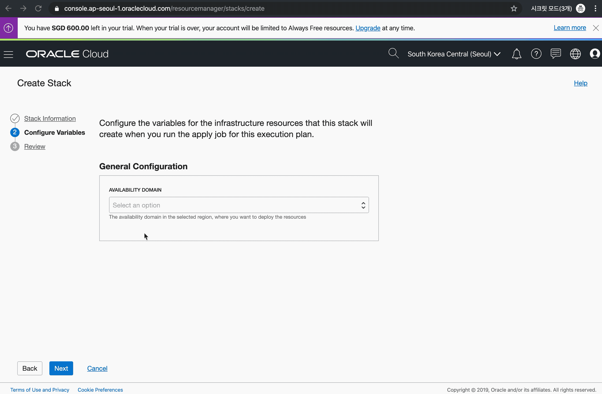

### **STEP 5**: Resource Manager Plan Job 실행하여 실행 계획 확인
Terraform의 주요 Action에는 Plan, Apply, Destroy가 있습니다. 모든 액션은 Stack 단위로 이루어 집니다.

**Plan**  
> 실제 인프라에 Terraform HCL을 적용하는 것이 아니라, 실행하면 어떤 리소스가 생성되고, 수정되며, 사라지는지를 사전에 계획해보는 단계입니다. 작성한 HCL을 확인 없이 바로 인프라에 적용하는 것은 매우 위험한 일이기 때문에 적용전에 체크하는 단계로 이해하면 됩니다.

**Apply**  
> Plan에서 원하는 결과가 나왔다면, Apply를 통해 실제 인프라에 Terraform HCL을 적용합니다.

**Destroy**  
> Apply로 생성한 모든 리소스를 삭제합니다. 

먼저 Stack에서 Plan Action을 합니다.
1. Terraform Configuration Plan Action
    > Terraform Actions > Plan 선택

    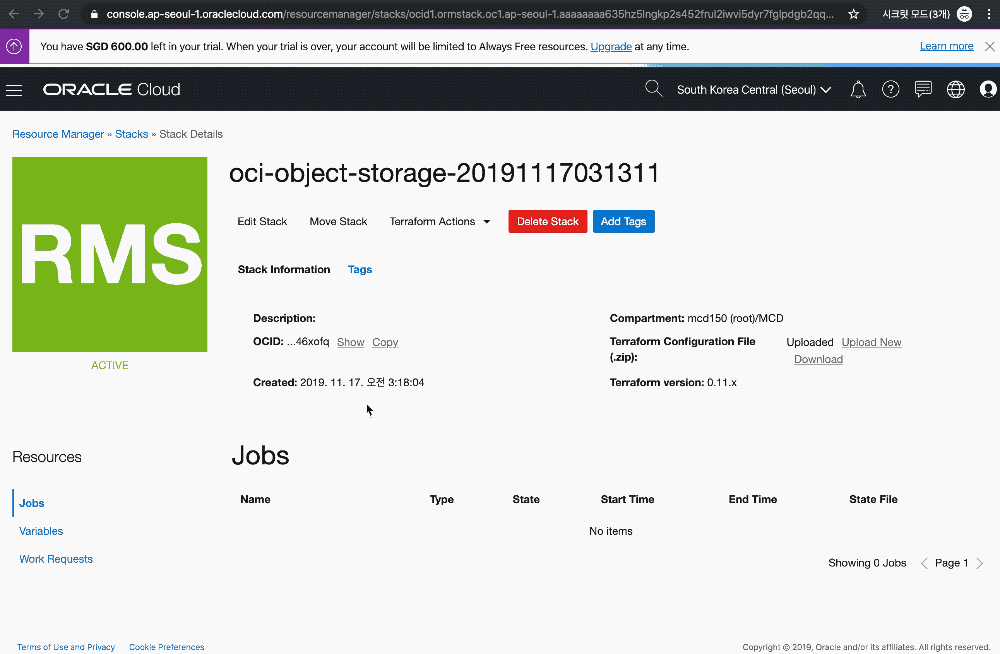

2. Plan Job 실행 로그 확인

    

3. Plan Job 실행 결과 확인

    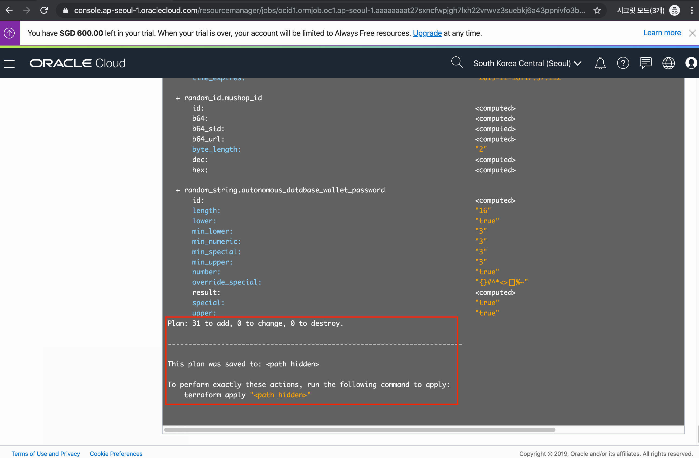

### **STEP 6**: Resource Manager Apply Job 실행하여 인프라에 반영
1. Terraform Configuration Apply Action
    > Terraform Actions > Apply 선택

    

2. Terraform Configuration을 적용하는 Job 실행 로그 확인

    

3. Job 실행 완료, 하단에 output 정보 확인

    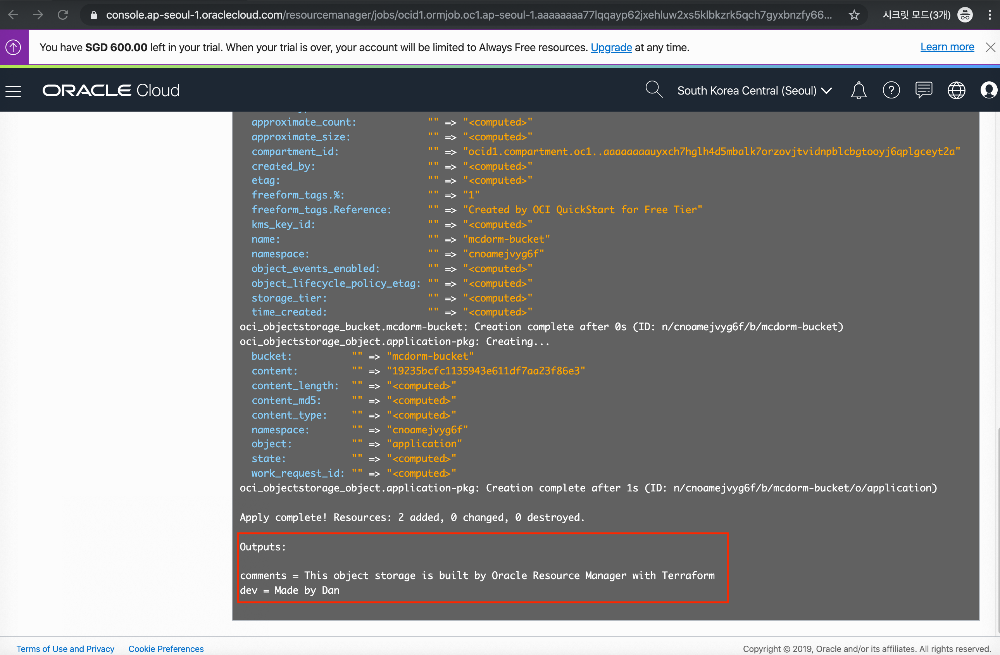

4. 생성된 리소스 확인 (Object Storage)
    > 좌측 상단의 햄버거 메뉴 > Object Storage

    


### **STEP 7**: Resource Manager Apply Destroy Job 실행하여 생성된 리소스 삭제
1. Resource Manager Stack에서 Destroy를 통해 Stack으로 생성된 모든 리소스 삭제를 위한 Destroy Action 수행
> Terraform Actions > Destroy

 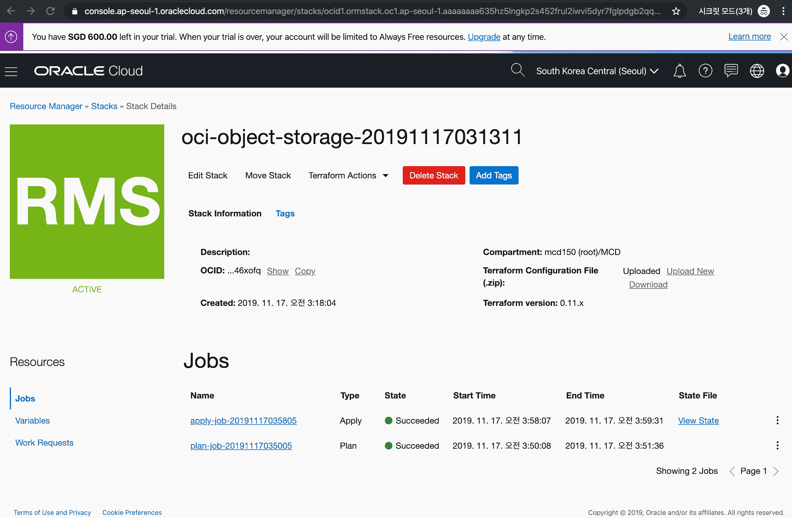

2. Destroy 완료

 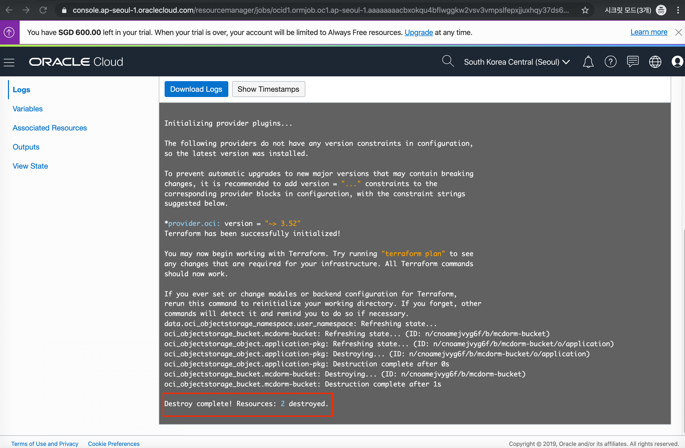

3. Destroy 확인

 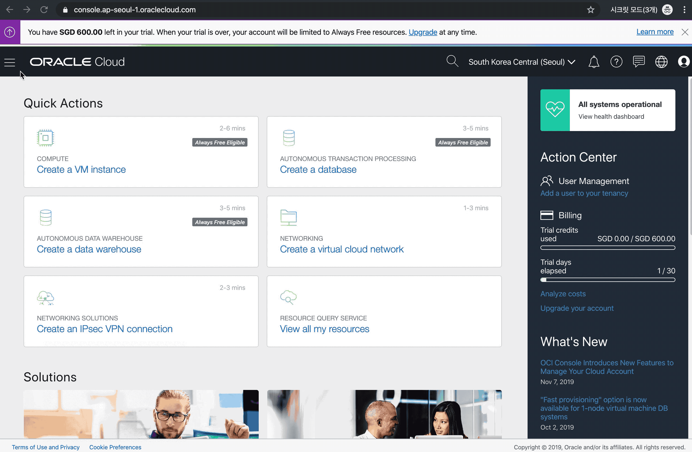

</details> 

***

### ***[PART 2]*** 복잡한 3-tier 웹 애플리케이션 운영 환경 구성, 그리고 배포까지 신속하게!
Terraform과 Resource Manager를 활용하여 3-tier 웹 애플리케이션 운영 환경을 신속하게 프로비저닝 및 실제 애플리케이션을 배포하여 구동해 봄으로써, 오라클 클라우드의 다양한 리소스들을 빠르게 프로비저닝하는 것을 경험해봅니다.

<details>
<summary>
<i>PART2 따라하기</i>
</summary>

총 7개의 단계로 구성됩니다.  
**STEP 1**: Oracle Resource Manager에서 사용할 Zip 패키지 다운로드  
**STEP 2**: OCI Console 로그인  
**STEP 3**: Resource Manager Stack 생성  
**STEP 4**: Resource Manager Plan Job 실행  
**STEP 4**: Resource Manager Apply Job 실행  
**STEP 5**: 생성된 OCI Resource와 웹 애프리케이션 배포 확인  
**STEP 6**: 생성된 모든 리소스 삭제  
**STEP 7**: 삭제 리소스 확인  

***

### STEP 1: Oracle Resource Manager에서 사용할 Zip 패키지 다운로드
Resource Manager에서 사용할 Terraform Configuration과 웹 애플리케이션 소스를 포함하는 Zip 패키지 파일 [mushop-basic-stack.zip](https://objectstorage.ap-seoul-1.oraclecloud.com/n/apackrsct01/b/bucket-20190614-1639/o/mushop-basic-stack.zip)을 다운로드 받습니다.

<details>
<summary>
<i>참고) Resource Manager에서 사용할 Zip 패키지 파일 내용 보기</i>
</summary>

다운로드 받은 Zip파일 내용
> provider.tf : Cloud Provider 정의 (oci)  
> main.tf : Compute Instance Shape 생성  
> variables.tf : Terraform Configuration에서 사용할 변수 정의  
> datasources.tf : OCI에 생성된 리소스 일부를 데이터소스로 가져옴 (tenancy_ocid, object_namespace, database_wallet)  
> policy.tf : Object Storage 관리를 위한 Policy 생성  
> network.tf : VCN, Subnet, NAT, Internet Gateway, Service Gateway, Route Table 생성  
> loadbalancer.tf : Load Balancer 생성 및 Backend Set 구성   
> security-lists.tf : VCN에 Security List 적용 (Loadbalancer Subnet에 80포트 추가 등)  
> storage.tf : Object Storage Bucket 생성 및 애플리케이션 소스, 설정 파일등을 업로드  
> atp.tf : ATP Database 생성  
> outputs.tf : 최종 실행 결과 출력
> scripts : Object Storage에 있는 소스 및 설정, Wallet 파일 다운로드, JDBC 연결을 위한 Oracle Instantclient 설치, DB Table 및 Data 생성 스크립트 실행, 환경 변수 설정
> scripts/mushop-basic.tar.gz : nodejs application, frontend 소스 및 이미지

</details>

### **STEP 2**: OCI Console 로그인
> https://console.ap-seoul-1.oraclecloud.com 접속 > Tenant 입력 > **Continue** 클릭 > Oracle Cloud Infrastructure 아래 사용자 이름(User Name)과 암호(Password) 입력 > **Sign In** 클릭


### **STEP 3**: Resource Manager Stack 생성
Terraform Configuration과 웹 애플리케이션 소스를 포함하고 있는 Zip 파일을 OCI Resource Manager Stack으로 등록하는 과정입니다.

1. Resource Manager의 Stacks
    > 좌측 상단의 햄버거 메뉴 > Resource Manager > Stacks > MCD Compartment 선택

    

2. Resource Manager Stack 생성 1
    > **Create Stack** 클릭 > 다운로드 받은 Zip 패키지 선택 > Compartment(MCD) 선택 > Terraform Version 선택 (본 실습에서는 0.11.x 버전으로 진행) > **Next** 클릭

    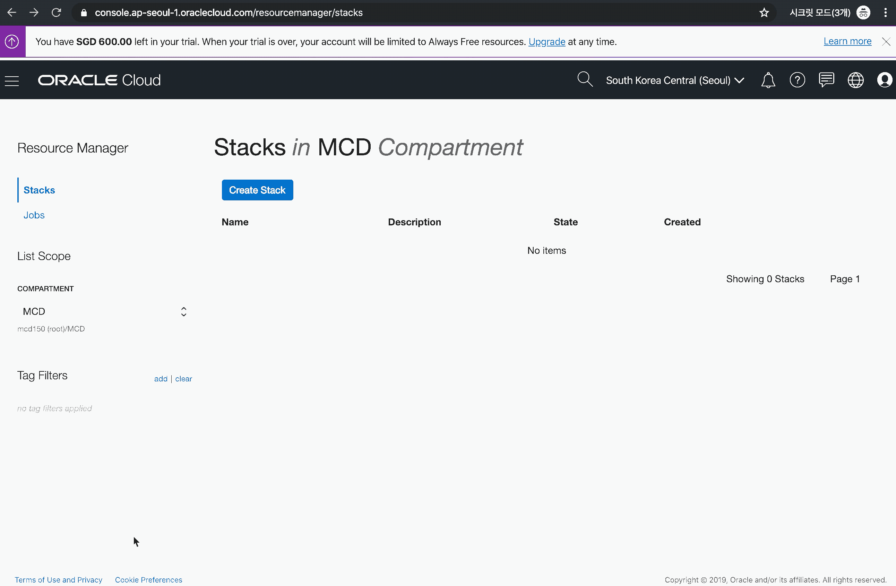

3. Resource Manager Stack 생성 2
    > Terraform 변수 값 (Variables)을 다음과 같이 변경 
    > 
    > Database Name : mushop (기본값)  
    > NODE COUNT : 1 (기본값)  
    > 생성된 Available Domain 선택 > **Next** 클릭 > Stack Review 에서 **Create** 버튼 클릭

    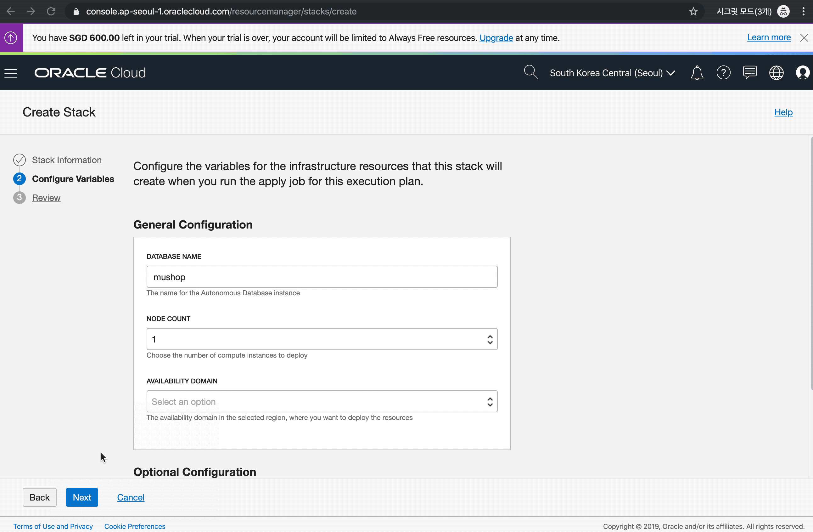

### **STEP 4**: Resource Manager Plan Job 실행
1. Terraform Configuration Plan Action
    > Terraform Actions > Plan 선택

    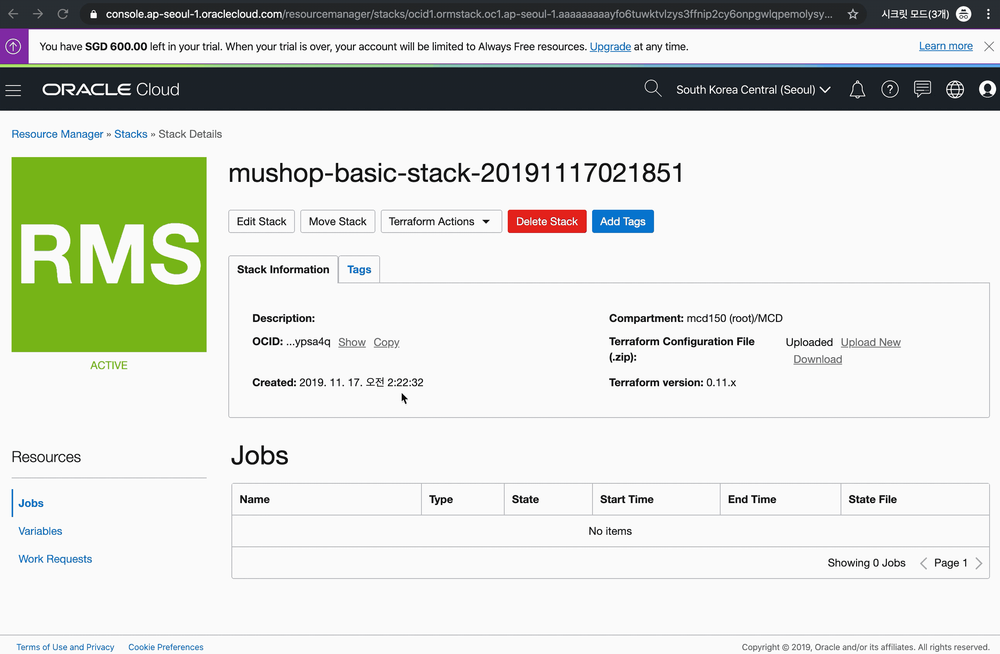

2. Plan Job 실행 로그 확인

    

3. Plan Job 실행 결과 확인

    


### **STEP 5**: Resource Manager Apply Job 실행
1. Terraform Configuration Apply Action
    > Terraform Actions > Apply 선택

    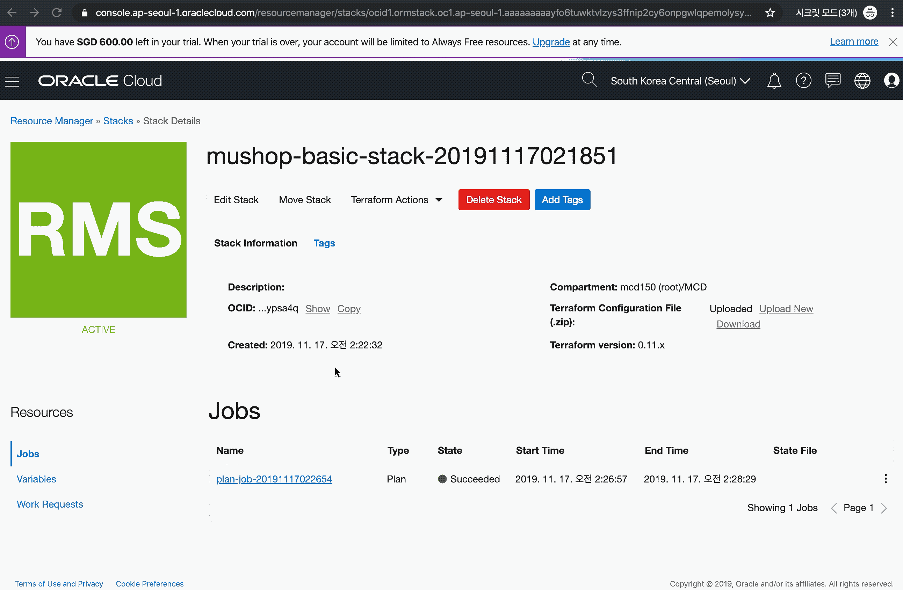

2. Terraform Configuration을 적용하는 Job 실행 로그 확인

    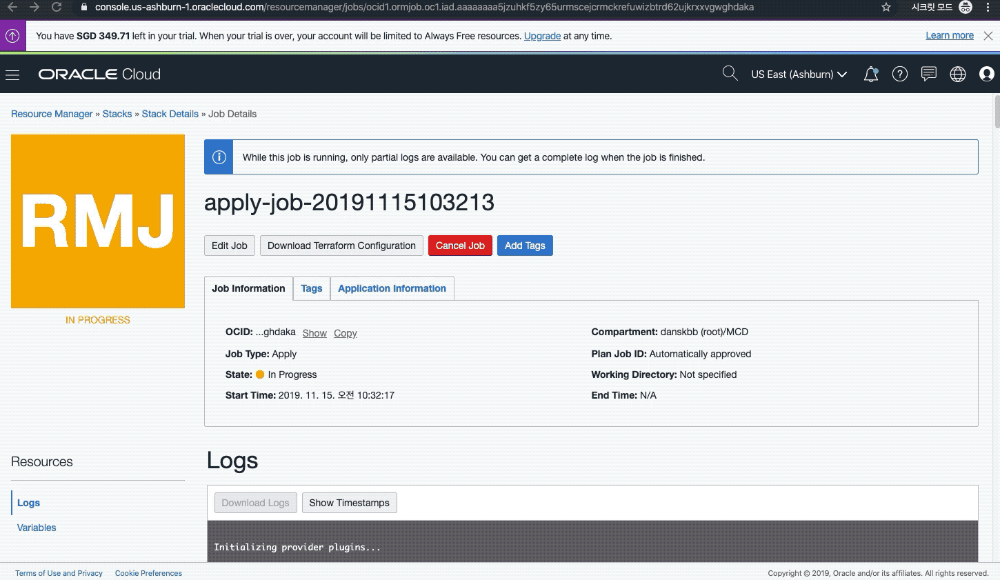

3. Job 실행 완료, 하단에 Load Balancer의 External IP를 확인

    

### **STEP 5**: 생성된 OCI Resource와 웹 애프리케이션 배포 확인
1. Compute Instance 확인
    > 메뉴 > Compute > Instances

    

2. VCN 확인
    > 메뉴 > Networking > Virtual Cloud Networks

    

3. Load Balancer 확인
    > 메뉴 > Networking > Load Balancers

    


4. ATP 확인 
    > 메뉴 > Autonomous Transaction Processing

    


5. Object Storage 확인 
    > 메뉴 > Object Storage

    


6. Policy 확인 
    > 메뉴 > Identity > Policies, Compartment를 root로 선택

    


7. 접속 확인
    위 로그에서 확인된 Load Balancer IP를 통해 브라우저로 접속 (예시: http://129.213.211.152/)
    > 실제 배포된 애플리케이션 구성이 완료되기 까지 수 분의 시간이 소요됩니다.

    

### **STEP 6**: 생성된 모든 리소스 삭제
1. Resource Manager Stack에서 Destroy를 통해 Stack으로 생성된 모든 리소스 삭제를 위한 Destroy Action 수행
> Terraform Actions > Destroy

 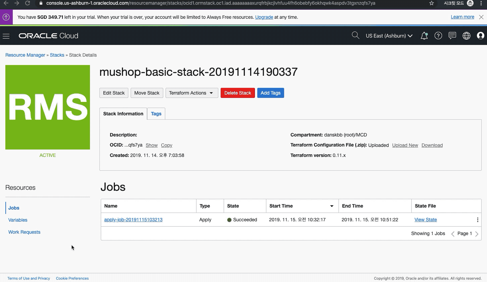

2. Destroy 진행중

 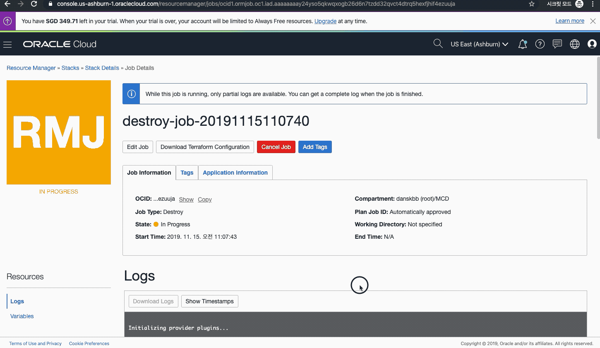

4. Destroy 완료

 

## **STEP 7**: 삭제 리소스 확인
STEP5에서와 동일하게 모든 OCI 리소스 확인


</details> 


***

## 참고
<details>
<summary>
<i>Terraform</i>
</summary>

Terraform은 Hashicorp에서 개발한 인프라스트럭처 관리를 위한 오픈소스 소프트웨어로, 인프라스트럭처를 코드로서 관리 및 프로비저닝하는 개념인 Ifrastructure as Code (IaC)를 지향하는 도구라고 볼 수 있습니다. Terraform에서는 HCL(Hachicorp Configuration Language)라는 설정 언어를 이용해서 인프라스트럭처를 정의합니다.

</details>

<details>
<summary>
<i>Resource Manager</i>
</summary>

Oracle Resource Manager는 Oracle Cloud Infrastructure(이하 OCI)의 리소스 프로비저닝을 자동화 하는 기능으로, Terraform Configuration 사용해서 실행하는 기능입니다. Resource Manager를 사용하면 별도 클라이언트 환경에 Terraform 설치나 환경 구성이 필요 없으며, OCI Console을 통해 Terraform Configuration을 관리, Apply, Plan, Destroy를 할 수 있습니다. 이외에도 Terraform Configuration 실행 로그 관리, IAM(Identity and Access Management)를 통한 사용자 통제, Terraform 변수 및 상태 (State: Terraform Configuration을 Apply할 때 Apply한 결과를 가지는 파일로 인프라 변경내용을 추적할 수 있음) 관리
등의 기능을 제공합니다.

Stack
스택은 Terraform Configuration 묶음을 등록하여 생성하는 Provisioning 단위입니다.

Job
Job은 스택으로 등록된 Terraform Configuration의 실행 작업이며, Terraform에서 경험한 것 처럼 Terraform Plan, Apply, Destroy이 실행되는 작업입니다.
</details>

<details>
<summary>
<i>샘플 애플리케이션 (MuShop)</i>
</summary>

샘플 애플리케이션은 MuShop 이라는 이름을 가진 이커머스 웹 사이트(고양이 관련 용품 판매)로 3-tier (Nodejs, Database:Oracle Autonomous Transaction Processing)로 구성된 웹 애플리케이션입니다.
해당 애플리케이션에는 애플리케이션 구동에 필요한 모든 리소스와 설정을 담고 있는 Terraform 코드를 포함하고 있습니다.


|  |  |  |  |
|---|---|---|---|

## Topology


</details>
